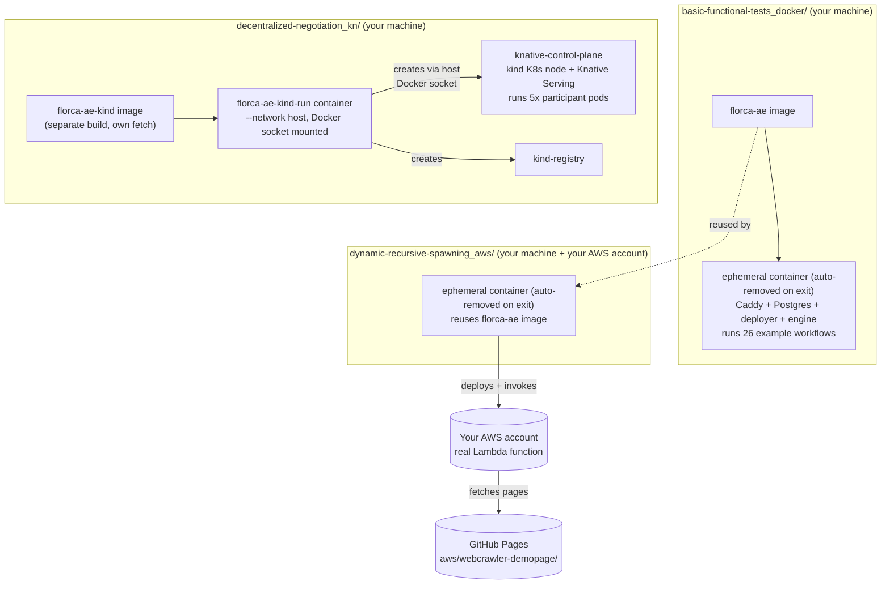

# FloatingOrca — Middleware 2026 Artifact Evaluation Helper

This is a helper repo that provides convenience scripts to easily setup and
run [FLORCA](https://github.com/floating-orca/florca), the system described in
[FLORCA: A Lightweight Runtime for Dynamic Serverless Function Coordination and Execution](https://doi.org/10.1145/3801927.3810470)
(Middleware '26). Every script here fetches the exact archived `v0.8.1`
release from the paper 
(software DOI [10.5281/zenodo.19712026](https://doi.org/10.5281/zenodo.19712026))
and builds/runs it.

## AI Disclaimer
We used Claude Code, running Sonnet 5 to generate the scripts and readme file in this repository. 
We validated the scripts for correctness and adapted and refined the readme for readability. 
We take full responsibility for the content of this repository.

## Badges requested

- **Artifacts Available**
- **Artifacts Functional**


## What FLORCA does (FLORCA paper, Section 3)

FLORCA introduces three primitives: `run`, `next`, and
`sendMsg`.

- **`run`** — a function spawns another function.
- **`next`** — a function picks its own successor.
- **`sendMsg`** — functions exchange messages with each other during
  execution.

## Looking for the real project / Implementation (FLORCA paper, Section 4)

Go to **https://github.com/floating-orca/florca**. That's the maintained
FLORCA repository, implementing the above. FLORCA splits execution into
two planes (paper, Section 4.1): the **control plane**, where Plugin
Functions run inside the engine itself and implement coordination
logic, and the **application plane**, where External Functions run on
an existing FaaS backend (Knative or AWS Lambda) that the engine
invokes for elasticity. 
The code consists of the following: 

- **engine** (Rust) — core infrastructure and message transport; keeps
  the state of each workflow run.
- **driver** (Deno, one per running workflow) — interprets `run` calls
  and `next` events, executes Plugin Functions, invokes External
  Functions, and dispatches `sendMsg` messages.
- **deployer** — manages function deployment and metadata across
  backends (Knative, AWS Lambda).
- **CLI** — the developer-facing tool for scaffolding, deploying, and
  inspecting FLORCA applications.

It also has the user/developer documentation and the growing suite of
30 example applications the paper mentions (Section 4.3), with
releases continuing past the version presented in the paper. The same
documentation, pre-built from the archived `v0.8.1` source, ships in
this repository at [`docs-v0.8.1/index.html`](./docs-v0.8.1/index.html)
— open it directly in a browser, no build step needed.

## Running FLORCA / Evaluation (FLORCA paper, Section 5)

**Prerequisites:** Docker with BuildKit, and Linux (or WSL2 on Windows —
FLORCA itself isn't supported on native Windows). If you encounter
problems related to BuildKit during build, refer to your package
manager to install the BuildKit plugin (e.g. `docker-buildx` on Arch).

The paper evaluates FLORCA through four benchmarking applications
(Section 5.1), each exercising a different combination of `run`,
`next`, and `sendMsg`. 
To prove functionality, we provide helper scripts that build FLORCA into a
Docker container and run
a basic functionality test, consisting only of Plugin Functions, and
**two of the paper's applications on a
reduced problem size, in a single-machine, deployable setup**.
The two applications are Application 3 and 4 (Web-Crawler and Decentralized Negotiation). 


| Folder | Backend | Paper's experiment | What it exercises |
|---|---|---|---|
| [`basic-functional-tests_docker/`](./basic-functional-tests_docker) | Plugin (in-process) | — | deploys and runs the repo's Plugin-only example workflows (26 test cases), covering basic round-trips plus edge cases like retries, timeouts, failures, and sibling coordination |
| [`decentralized-negotiation_kn/`](./decentralized-negotiation_kn) | Knative | Decentralized Negotiation (`flexi-consensus-kn`) | `run` + `next` + `sendMsg`: multi-round peer coordination |
| [`dynamic-recursive-spawning_aws/`](./dynamic-recursive-spawning_aws) | AWS Lambda (opt-in, needs your own AWS account) | Web-Crawler (`webcrawler-video`) | `run` + `sendMsg`: recursive dynamic spawning |

`basic-functional-tests_docker/` proves FLORCA is available and
functional: the engine and deployer are built, and a test suite of 26
small workflows consisting of Plugin Functions is deployed and run,
without an external FaaS backend. `decentralized-negotiation_kn/`
extends this by additionally deploying and running External Functions
on Knative, showing the same coordination layer works across a remote
FaaS backend - central to the paper's contribution. In our opinion,
`dynamic-recursive-spawning_aws/` is optional: the
first already proves functionality, and the second already shows it
working with an external FaaS backend. We include it for completeness, showing
the same capability on AWS Lambda as a second backend.

Setup of the experiments:



**`basic-functional-tests_docker/`**:

```bash
cd basic-functional-tests_docker
./build.sh
./run-functional-check.sh
```

**`decentralized-negotiation_kn/`**:

```bash
cd decentralized-negotiation_kn
./build.sh
./run.sh
./teardown.sh   # when done
```

**`dynamic-recursive-spawning_aws/`** (read `setup-aws-roles.sh` first):

```bash
cd dynamic-recursive-spawning_aws
./setup-aws-roles.sh
./run-aws-check.sh
./teardown-aws-roles.sh   # when done
```

Roughly, what each script does:

- **`basic-functional-tests_docker/build.sh`** — fetches `v0.8.1` from
  Zenodo, builds a self-contained image (deployer, engine, Caddy,
  Postgres), and builds the documentation.
  **`basic-functional-tests_docker/run-functional-check.sh`** —
  deploys and runs the example workflows (26 test cases), checking
  each for success.
- **`decentralized-negotiation_kn/build.sh`** — same fetch, plus
  pinned `kind`/`kubectl`/`kn`/`func` tooling.
  **`decentralized-negotiation_kn/run.sh`** — creates (or reuses) a
  local Knative cluster, deploys and runs `flexi-consensus-kn`.
  **`decentralized-negotiation_kn/teardown.sh`** — removes the cluster
  and container.
- **`dynamic-recursive-spawning_aws/setup-aws-roles.sh`** — creates
  two scoped IAM resources (an execution role, a deployer user) in
  your AWS account.
  **`dynamic-recursive-spawning_aws/run-aws-check.sh`** — deploys and
  runs `webcrawler-video` against real Lambda.
  **`dynamic-recursive-spawning_aws/teardown-aws-roles.sh`** — removes
  what `setup-aws-roles.sh` created.

And what the workflows themselves do:

- **[Example workflows](https://github.com/floating-orca/florca/tree/v0.8.1/examples)**
  (`basic-functional-tests_docker/`) — 26 small, Plugin function-only test
  cases covering basic deploy/run round-trips plus edge cases like retries,
  timeouts, failures, and sibling coordination.
- **[`flexi-consensus-kn`](https://github.com/floating-orca/florca/tree/v0.8.1/examples/flexi-consensus-kn)**
  — a Coordinator Plugin Function runs negotiation rounds with 5 simulated
  Negotiator functions (External Functions, on Knative). Each round, the
  Coordinator proposes allocations; Negotiators reply accept/reject via
  `sendMsg`; this repeats via `next` until agreement or a round limit is
  reached.
- **[`webcrawler-video`](https://github.com/floating-orca/florca/tree/v0.8.1/examples/webcrawler-video)**
  — starting from a seed page, a Lambda function fetches the page and
  extracts links (and any video references); newly discovered links are
  recursively crawled the same way via further Lambda invocations, reported
  back via `sendMsg`, until no new pages remain. Here it's pointed at a
  bounded, 100-page static graph (generated by the paper's own web-graph
  generator) instead of a live website, so the crawl is deterministic and
  finite.


